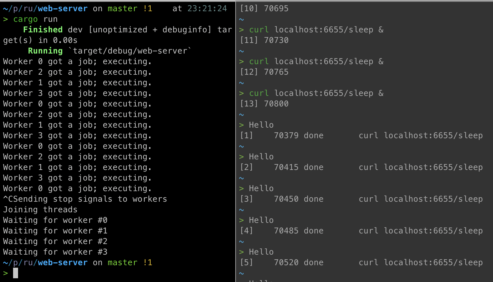

Test web server
===

Implemeted toy webserver with hand written thread pool and channels.

Execution of 4 job concurrently with clean exit on ctrl-c:

links:

+ https://doc.rust-lang.org/book/ch20-00-final-project-a-web-server.html
+ https://docs.rs/crossbeam-channel/0.5.4/crossbeam_channel/

